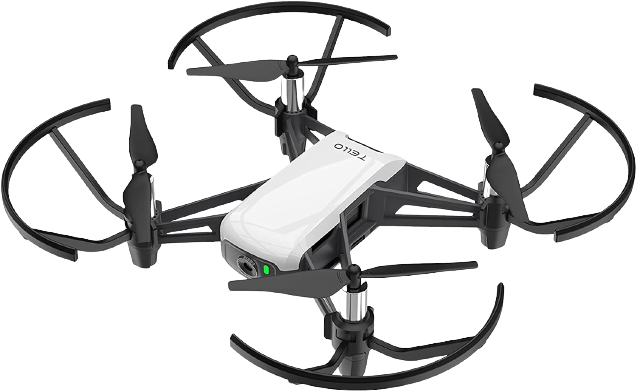

# Tello




C++14 single-header cross-platform library to control a DJI Ryze Tello drone using the [Tello SDK 2.0](https://dl-cdn.ryzerobotics.com/downloads/Tello/Tello%20SDK%202.0%20User%20Guide.pdf).

## Build process🛠️

There is no build or install process for the library. You only need to include [tello.hpp](tello.hpp) and that's it. Look at the examples to see how to use it.

Alternatively, there is also a `CMakeLists.txt` available, so if you want to keep it easy to update you might also use this repository as a git submodule. Then you would simply include the library in cmake. Take a look at the [example](example) folder to see how it is done using CMake.

## Portability/Compatitibility📌

This library is written in C++14, which means your program including it must be compiled using at least C++14 or higher. It was written in a way that it is compatible with compilers going back to gcc-4.9, which was the gcc version for Debian Jessie.

This library is cross-platform, it works exactly the same on Windows and Linux. MacOS is untested. It was tested on Windows 10 and on Debian Jessie for backwards compatibility.

`tello.hpp` includes the Linux API or the Win32 API correspondingly. If this causes a conflict with another library or simply pollutes your headers too much, you must separate them by moving it into a different cpp file. In the best case, only use the Tello library in a single cpp file and do all other stuff in other files, not touching the Tello calls anymore. This gives you the cleanest project and the fastest build times.

## Examples🖥️

### Building the example

```bash
cd example
mkdir build
cd build
cmake ..
cmake --build .    # Build the app, regardless of the build system (e.g. calls 'make')
```

### Simple example

```c++
Tello tello;
if (!tello.connect()) {     // This can take a different Tello IP address if needed
    return;
}

tello.takeoff();

// Do something, fly around

tello.land();
```

### CMake

The following would be the simplest CMakeLists.txt for working with the tello library.

```cmake
cmake_minimum_required(VERSION 3.0.2)

project(example)

add_subdirectory(../tello bin)  # Path to tello library

add_executable(example main.cpp)
target_link_libraries(example tello::tello) # Link to it

if (MSVC)   # At least C++14 standard required
    target_compile_options(example PUBLIC /std:c++14)
else()
    target_compile_options(example PUBLIC --std=c++14)
endif()
```

### Most important functions

These are your basic functions for controlling the Tello drone
```c++
tello.connect();
tello.takeoff();
tello.land();
```

Basic incremental movement functions
```c++
tello.set_speed(cm/s)
tello.move_up(cm);
tello.move_down(cm);
tello.move_left(cm);
tello.move_right(cm);
tello.move_forward(cm);
tello.move_back(cm);
tello.turn_right(degrees);
tello.turn_left(degrees);
tello.move_by(x, y, z, speed);
```

Main function for more sophisticated controllers: This function basically simulates an RC controller, so it can be called in a loop to continuously set the speed in all directions
```c++
tello.move(left/right, forward/backward, up/down, yaw);
```

Sensor readings
```c++
tello.get_speed();
tello.get_battery_level();
tello.get_flight_time();
tello.get_wifi_snr();
tello.get_sdk_version();
tello.get_serial_number();
```

Disclaimer: Only the functions which you are most likely to use are listed here. Not all are documented.

### Sleep

And finally, there is also sleep. This is just for your convenience, it simply puts the current thread to sleep for x milliseconds;

```c++
tello.sleep(100);       // Sleep 100ms
```

### Mission Pad API

All functions regarding Mission Pads are separated into a nested structure, because they are very uncommon to use for most users. This keeps your IntelliSense suggestions clean.

```c++
tello.missionPadAPI.enable_pad_detection();
tello.missionPadAPI.disable_pad_detection();
tello.missionPadAPI.set_pad_detection_direction();
tello.missionPadAPI.fly_straight_to_pad();
tello.missionPadAPI.fly_arc_to_pad();
tello.missionPadAPI.jump_to_next_pad();
```

### Tello State example

This is the way to access the Tello State string which is streamed by the Tello. The string is parsed automatically in the background, as soon as one arrives. `tello.state();` is thread-safe.

```c++
while (true) {
    auto state = tello.state();		// These values are refreshed 
                                    // asynchronously at around 10 Hz
    
    std::cout << "pitch: " << state.pitch << std::endl;
    std::cout << "roll: " << state.roll << std::endl;
    std::cout << "yaw: " << state.yaw << std::endl;
    
    std::cout << "height: " << state.height << std::endl;
    std::cout << "sea height: " << state.sea_height << std::endl;
    std::cout << "accel x: " << state.agx << std::endl;
    std::cout << "accel y: " << state.agy << std::endl;
    std::cout << "accel z: " << state.agz << std::endl;
    
    std::cout << std::endl;
    
    tello.sleep(100);   // Wait 100ms
}
```

## Vision Support (OpenCV camera stream)🎥

Below is an example for capturing the live video stream of the Tello. As soon as enabled, the Tello will stream the video feed to the UDP port 11111, encoded in h264 encoding. Simply listen on this port for incoming packets.

The example below shows how it can be done directly in recent OpenCV versions, on older versions you might have to implement an external h264 decoder manually as OpenCV might not have supported it back then.

This example was tested with OpenCV 4.5.4.

```c++
#include "tello.hpp"

#include "opencv2/core.hpp"
#include "opencv2/highgui.hpp"
#include "opencv2/imgcodecs.hpp"

int main() {

    cv::VideoCapture capture{"udp://0.0.0.0:11111", cv::CAP_FFMPEG};

    Tello tello;
    if (!tello.connect()) return 0;
    tello.enable_video_stream();

    while (true) {
        cv::Mat frame;
        capture >> frame;
        if (!frame.empty()) {
            cv::imshow("Tello Stream", frame);
        }
        if (cv::waitKey(1) == 27) {
            break;
        }
    }
}
```

## My drone is not connecting📢

To connect to the drone, connect to its wi-fi and then run the program. If it doesn't connect instantly, there are some things you might watch out for:

 - **(1) The Firewall**: Some specific ports must be open so that the drone can respond back. Port 8889 goes to the drone and is usually not a problem (outgoing). Ports 8890, 11111 and 36085 are ingoing and must be allowed.

 - **(2) Inside a Virtual Machine**: The same as above applies for a virtual machine. The ingoing ports must be allowed on both machines. Additionally, you must set up port forwarding for these 3 ports from your host to your VM. This is usually done in your VM's Hypervisor settings.


## Licensing📃

This library is released under the MIT License. This means you are allowed and even encouraged to copy and paste `tello.hpp` directly into your project. No installation or build process is necessary.

## Acknowledgements💡

This library uses the [UDPsocket](https://github.com/barczynsky/UDPsocket) single-header library, embedded directly into `tello.hpp` itself.

## Support 💪

I do all of my projects in my free time and I do not get any money for that. I just like what I do, do it for myself and want to share it so that others can benefit too.

<a href="https://www.buymeacoffee.com/herrnamenlos123" target="_blank">
    
</a>

Exactly for this reason would it be even more amazing if you could find the motivation to buy me a coffee :)
